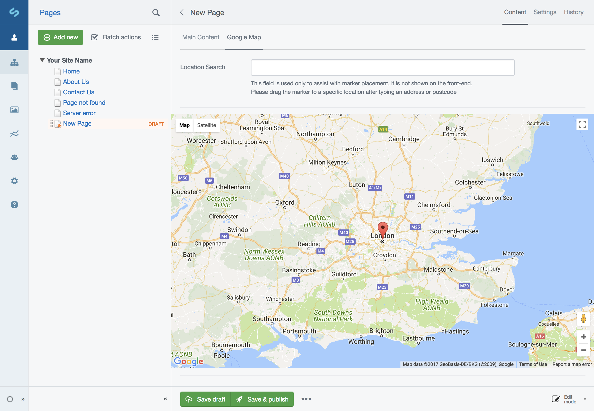

# SilverStripeGMapsObject

A module to add a Google Map (optionally with Streetview) to a DataObject or Page, with users able to specify a location marker in the CMS. No front-end implementation is provided, though simple examples are shown below.

By:
Loz Calver - [Bigfork Ltd](http://www.bigfork.co.uk/).



## Installation:

### Composer:

```
require: "kinglozzer/silverstripegmapsobject": "^2"
```

### Enable:

Apply the extension `Kinglozzer\SilverStripeGMapsObject\Extension` to the DataObject or page type that you require a map on and do a `dev/build?flush=1`.

```yaml
Page:
  extensions:
    - Kinglozzer\SilverStripeGMapsObject\Extension
```

You'll then see the new 'Google Map' tab on your DataObject / Page edit form. You also need to specify your Google Maps API key in the 'Settings' area of the CMS before you'll be able to see the map.

## Front-end Examples:

The co-ordinates (and heading/pitch if you're using Streetview) are stored in the following database fields:

- Latitude
- Longitude
- Heading
- Pitch

You'll need to give your JavaScript access to these properties, one method of doing this is as follows:

```php
class PageController extends ContentController
{
	public function init()
    {
		parent::init();

		// Fetch the Google Maps API key from the site settings
		$key = SiteConfig::current_site_config()->GMapsAPIKey;
		Requirements::javascript('https://maps.googleapis.com/maps/api/js?key='.$key.'&sensor=false');

		Requirements::customScript(<<<JS
var gMap = {
	'lat': $this->Latitude,
	'lon': $this->Longitude,
	'heading': $this->Heading,
	'pitch': $this->Pitch
};
JS
		);
	}
}
```

Example JavaScript implementation:

```js
// Assumes one div with the id "map"
var latLng = new google.maps.LatLng(gMap.lat,gMap.lon),
	map = new google.maps.Map(document.getElementById("map"), {
		center: latLng,
		zoom: 14,
		mapTypeId: google.maps.MapTypeId.ROADMAP
	}),
	marker = new google.maps.Marker({
		position: latLng,
		map: map,
		title: 'My location'
	});
```

Example JavaScript implementation including Streetview:

```js
// Assumes two divs, one with the id "map" and one with the id "street-view"
var panorama = new  google.maps.StreetViewPanorama(document.getElementById("street-view"), {
		position: new google.maps.LatLng(gMap.lat,gMap.lon),
		visible: true,
		pov: {
			heading: gMap.heading,
			pitch: gMap.pitch
		}
	});
	var map = new google.maps.Map(document.getElementById("map"), {
		center: new google.maps.LatLng(gMap.lat,gMap.lon),
		zoom: 14,
		mapTypeId: google.maps.MapTypeId.ROADMAP,
		streetViewControl: true,
		streetView: panorama
	});

	google.maps.event.addListener(panorama, "position_changed", function() {
		map.setCenter(panorama.getPosition());
	});
```
